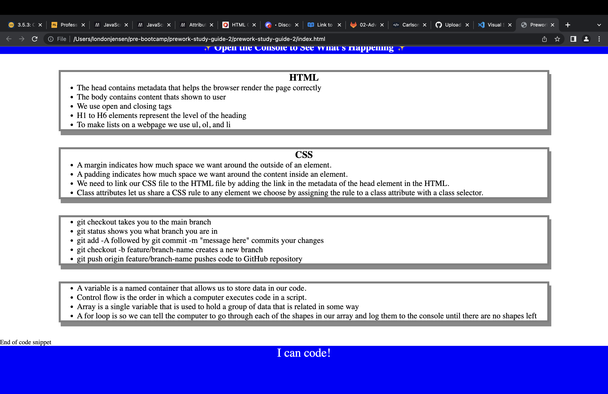

# prework-study-guide-2

## Description

Provide a short description explaining the what, why, and how of your project. Use the following questions as a guide:

- What was your motivation? To build a webpage that me and other developers could look at as a guide on how to use VS code, and what an HTML, CSS, and JavaScript file is.
- Why did you build this project? (Note: the answer is not "Because it was a homework assignment.") I built this project for developers to use as a tool, it provides information on what HTML, CSS, JavaScript, and Git is.
- What problem does it solve? It gives developers a tool to look at if they are confused about what the files are.
- What did you learn? I learned how to use the command line. I learned how to create a GitHub repository. I learned how to work in VS code. I learned how to create an issue in GitHub, as well as close it. I learned git commands, like creating a new branch, pushing and pulling to GitHub. I learned how to merge a file to GitHub. I learned about HTML, CSS, and JavaScript files.

## Table of Contents (Optional)

If your README is long, add a table of contents to make it easy for users to find what they need.

- [Installation](#installation)
- [Usage](#usage)
- [Credits](#credits)
- [License](#license)

## Installation

What are the steps required to install your project? Provide a step-by-step description of how to get the development environment running.
- Create a GitHub repository(Give it a unique name, make it public, add a MIT liscense, and add a README file)
- Add the unzipped files into the GitHub repository.
- In the terminal command line use git commands to create a directory. Then open file in VS code by entering "code ." into the command line.
- In VS code work on the HTML file, but make sure you are working on a feature branch. To do this enter on the command line "git checkout -b feature/add-html". 
- After completeing work in HTML enter in command line "git add -A", followed by "git commit -m 'add html'", then "git pull origin main", and finally "git push origin feature/add-html".
- Open GitHub repository and merge the pull request.
- Close the HTML issue.
- In command line enter "git checkout" to return to main branch, followed by "git pull origin main".
- Before starting on our CSS file we need to create a new feature branch. To do this enter on the command line "git checkout -b feature/add-css". 
- In VS code create an assets folder, then create a style.css file under it.
- Begin adding our CSS code, making sure it is linked to the HTML.
- When finished with the CSS we need to push it to GitHub repository. We do this by entering in command line "git add -A", followed by "git commit -m 'add css'", then "git pull origin main", and finally "git push origin feature/add-css".
- Open GitHub repository and merge the pull request.
- Close the CSS issue.
- Next we are working on JavaScript, under the assets foler we created in VS code is where we will add the JavaScript file.
- Before we get started lets enter in the command line "git checkout" to return to the main branch. Followed by "git pull origin main".
- Then, we create a new feature branch by entering on the command line "git checkout -b feature/add-js".
- We need to link the JS file to our index.html. This is done by entering   in the <body> element, after the <footer> element. *Note: I had to take out the "./assets" in "./script.js", because I forgot to create an assets folder. I also did this to my style.css file in the index.html for the same reason.
- Now once I added my JS information, I repeated the steps of entering in command line "git add -A", followed by "git commit -m 'add js'", then "git pull origin main", and finally "git push origin feature/add-js".
- I opened my GitHub repository and merged the pull request.
- I closed the JS issue.
- In the command line I entered "git checkout" to return to the main branch. Followed by "git pull origin main".
- Lastly I added to my README file.
- I also deployed my repository.

## Usage

Provide instructions and examples for use. Include screenshots as needed.

To add a screenshot, create an `assets/images` folder in your repository and upload your screenshot to it. Then, using the relative file path, add it to your README using the following syntax:

## Credits

List your collaborators, if any, with links to their GitHub profiles.

If you used any third-party assets that require attribution, list the creators with links to their primary web presence in this section.

If you followed tutorials, include links to those here as well.

## License

The last section of a high-quality README file is the license. This lets other developers know what they can and cannot do with your project. If you need help choosing a license, refer to [https://choosealicense.com/](https://choosealicense.com/).
I used the MIT liscense.

---

🏆 The previous sections are the bare minimum, and your project will ultimately determine the content of this document. You might also want to consider adding the following sections.

## Badges

Badges aren't necessary, but they demonstrate street cred. Badges let other developers know that you know what you're doing. Check out the badges hosted by [shields.io](https://shields.io/). You may not understand what they all represent now, but you will in time.

## Features

If your project has a lot of features, list them here.

## How to Contribute

If you created an application or package and would like other developers to contribute to it, you can include guidelines for how to do so. The [Contributor Covenant](https://www.contributor-covenant.org/) is an industry standard, but you can always write your own if you'd prefer.

## Tests

Go the extra mile and write tests for your application. Then provide examples on how to run them here.
